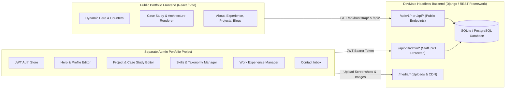

# DevMate Portfolio — Comprehensive REST API & Admin Dashboard Implementation Guide

This specification is the definitive architectural and integration reference for building your **Separate Admin Portfolio Dashboard Project** and consuming the **Headless Portfolio Backend**.

---

## 📑 Table of Contents
1. [Architecture & Server Overview](#1-architecture--server-overview)
2. [Base URLs & Environment Configurations](#2-base-urls--environment-configurations)
3. [Authentication & Token Lifecycle (JWT)](#3-authentication--token-lifecycle-jwt)
4. [Dashboard Analytics & Stats](#4-dashboard-analytics--stats)
5. [Hero Section & Profile Settings API](#5-hero-section--profile-settings-api)
6. [Projects Management & Case Study Documentation](#6-projects-management--case-study-documentation)
7. [Skills & Taxonomy Management](#7-skills--taxonomy-management)
8. [Work Experience & Workplace Imagery](#8-work-experience--workplace-imagery)
9. [Achievements & Certifications](#9-achievements--certifications)
10. [Categories Taxonomy API](#10-categories-taxonomy-api)
11. [Contact Inbox & Lead Management](#11-contact-inbox--lead-management)
12. [Blog & Technical Articles API](#12-blog--technical-articles-api)
13. [Public Frontend Endpoints Reference](#13-public-frontend-endpoints-reference)

---

## 1. Architecture & Server Overview



---

## 2. Base URLs & Environment Configurations

| Environment | Base URL (Public API) | Staff Admin API Base URL | Interactive Docs |
| :--- | :--- | :--- | :--- |
| **Local Development** | `http://127.0.0.1:8000/api/` | `http://127.0.0.1:8000/api/v1/admin/` | `http://127.0.0.1:8000/api/v1/admin/docs/` |
| **Production** | `https://logicbyroshan.in/api/` | `https://logicbyroshan.in/api/v1/admin/` | `https://logicbyroshan.in/api/v1/admin/docs/` |

---

## 3. Authentication & Token Lifecycle (JWT)

All `/api/v1/admin/*` endpoints require standard HTTP Bearer token authentication.

```http
Authorization: Bearer <YOUR_ACCESS_TOKEN>
```

### 3.1 Staff Login (Generate Tokens)
- **Method**: `POST`
- **Path**: `/api/v1/admin/auth/login/`
- **Request Body (JSON)**:
```json
{
  "username": "your_staff_username",
  "password": "your_secure_password"
}
```
- **Success Response (`200 OK`)**:
```json
{
  "success": true,
  "message": "Welcome back, Roshan Damor!",
  "access": "eyJhbGciOiJIUzI1NiIsInR5cCI6IkpXVCJ9...",
  "refresh": "eyJhbGciOiJIUzI1NiIsInR5cCI6IkpXVCJ9...",
  "user": {
    "id": 1,
    "username": "admin",
    "email": "mail@logicbyroshan.in",
    "is_staff": true,
    "is_superuser": true
  }
}
```

### 3.2 Refresh Access Token
- **Method**: `POST`
- **Path**: `/api/v1/admin/auth/refresh/`
- **Request Body (JSON)**:
```json
{
  "refresh": "<YOUR_REFRESH_TOKEN>"
}
```
- **Response (`200 OK`)**:
```json
{
  "access": "eyJhbGciOiJIUzI1NiIsInR5cCI6IkpXVCJ9..."
}
```

### 3.3 Get Current User Info
- **Method**: `GET`
- **Path**: `/api/v1/admin/auth/me/`
- **Headers**: `Authorization: Bearer <ACCESS_TOKEN>`

---

## 4. Dashboard Analytics & Stats

Retrieve real-time aggregate counters, telemetry numbers, and unread message indicators to render the admin dashboard home screen.

- **Method**: `GET`
- **Path**: `/api/v1/admin/analytics/dashboard/`
- **Headers**: `Authorization: Bearer <ACCESS_TOKEN>`
- **Response (`200 OK`)**:
```json
{
  "success": true,
  "data": {
    "projects": {
      "total": 6,
      "active": 6,
      "views": 2540,
      "likes": 189
    },
    "skills": {
      "total": 43,
      "categories": 5
    },
    "experience": {
      "total": 4
    },
    "achievements": {
      "total": 8
    },
    "messages": {
      "total": 12,
      "unread": 2
    }
  }
}
```

---

## 5. Hero Section & Profile Settings API

Manage personal details, social links, resume documents, and the **Hero section text, custom image, and 3 highlight stat cards**.

### 5.1 Get Current Profile & Hero Settings
- **Method**: `GET`
- **Path**: `/api/v1/admin/profile/`
- **Response (`200 OK`)**:
```json
{
  "success": true,
  "data": {
    "id": 1,
    "full_name": "Roshan Damor",
    "title": "Software Engineer · Full Stack AI",
    "email": "mail@logicbyroshan.in",
    "phone": "+91 90000 00000",
    "location": "Bhopal, Madhya Pradesh, India",
    "bio": "Software Engineer specializing in scalable full-stack web applications and AI workflows.",
    "profile_image": "/media/profile/hero.webp",
    "hero_image": "/media/hero/custom_hero.webp",
    "hero_badge": "Hello, I am",
    "hero_description": "I build production software and AI-powered applications, from backend systems and SaaS platforms to LLM-powered workflows and intelligent developer tools.",
    "hero_stat_1_value": "1,000+",
    "hero_stat_1_label": "Production Users",
    "hero_stat_1_icon": "fas fa-users",
    "hero_stat_2_value": "136K+",
    "hero_stat_2_label": "ID Cards Processed",
    "hero_stat_2_icon": "fas fa-id-card",
    "hero_stat_3_value": "86K+",
    "hero_stat_3_label": "Cards Downloaded",
    "hero_stat_3_icon": "fas fa-cloud-download-alt",
    "github": "https://github.com/logicbyroshan",
    "linkedin": "https://linkedin.com/in/logicbyroshan",
    "twitter": "https://twitter.com/logicbyroshan",
    "instagram": "",
    "youtube": "https://youtube.com/@logicbyroshan",
    "website": "https://logicbyroshan.in",
    "resume": "/media/documents/Roshan_Damor_Resume.pdf",
    "cover_letter": null,
    "video_resume": "https://www.youtube.com/@logicbyroshan",
    "status": "available",
    "work_type": "remote",
    "hourly_rate": "45.00",
    "experience_years": 3,
    "open_to_opportunities": true,
    "available_for_freelance": true
  }
}
```

### 5.2 Update Profile & Hero Settings
- **Method**: `PUT` or `PATCH`
- **Path**: `/api/v1/admin/profile/`
- **Request Body (JSON / Multipart)**:
```json
{
  "full_name": "Roshan Damor",
  "title": "Principal Full-Stack & Cloud Engineer",
  "hero_badge": "Available for Hire",
  "hero_description": "Architecting resilient distributed systems and production AI agents.",
  "hero_stat_1_value": "2,000+",
  "hero_stat_1_label": "Active SaaS Users",
  "hero_stat_1_icon": "fas fa-users"
}
```

### 5.3 Upload Profile Image
- **Method**: `POST`
- **Path**: `/api/v1/admin/profile/upload-image/`
- **Payload**: Multipart form with `profile_image` (JPG/PNG/WEBP)

### 5.4 Upload Custom Hero Visual Image
- **Method**: `POST`
- **Path**: `/api/v1/admin/profile/upload-hero-image/`
- **Payload**: Multipart form with `hero_image` (JPG/PNG/WEBP)

### 5.5 Delete Hero Image (Revert to default)
- **Method**: `DELETE`
- **Path**: `/api/v1/admin/profile/delete-hero-image/`

### 5.6 Upload Resume / Cover Letter (PDF)
- **Method**: `POST`
- **Path**: `/api/v1/admin/profile/upload-document/`
- **Payload (Multipart Form)**:
  - `file`: PDF file
  - `doc_type`: `"resume"` or `"cover_letter"`

---

## 6. Projects Management & Case Study Documentation

### 6.1 What the Frontend Client (`ProjectDetailPage.jsx`) Expects & Renders

```
┌─────────────────────────────────────────────────────────────┐
│  PROJECT HERO HEADER                                        │
│  - Category Badge (e.g. Software Engineering)               │
│  - Title: "{project_name} Technical Documentation"          │
│  - Subtitle: {description}                                  │
├─────────────────────────────────────────────────────────────┤
│  SCREENSHOT CAROUSEL & LIGHTBOX (from screenshots array)    │
├─────────────────────────────────────────────────────────────┤
│  META BAR: Status Pill | Views Counter | Live Heart Likes  │
│  TECH STACK PILLS (from technologies_list)                  │
│  ACTION PILLS: GitHub Repo | Live Application | Demo Video  │
├─────────────────────────────────────────────────────────────┤
│  SECTION 1: EXECUTIVE OVERVIEW & ARCHITECTURE STRATEGY      │
│  - Renders {documentation} (Rich HTML / Markdown)           │
├─────────────────────────────────────────────────────────────┤
│  SECTION 2: INTERACTIVE TOPOLOGY & D2 DIAGRAMS              │
├─────────────────────────────────────────────────────────────┤
│  SECTION 3: HIGH-RES GALLERY LIGHTBOX & VIDEO DEMO          │
├─────────────────────────────────────────────────────────────┤
│  PAGINATION: Previous Project  <───>  Next Project          │
└─────────────────────────────────────────────────────────────┘
```

### 6.2 List & Filter Projects
- **Method**: `GET`
- **Path**: `/api/v1/admin/projects/`
- **Query Parameters**:
  - `?status=active|completed|pilot|draft|archived`
  - `?is_active=true|false`
  - `?is_featured=true|false`
  - `?category=enterprise-saas`
  - `?search=cardflow`
  - `?page=1&page_size=20`

### 6.3 Create Project
- **Method**: `POST`
- **Path**: `/api/v1/admin/projects/`
- **Payload (Multipart Form Data)**:

| Field Name | Type | Description |
| :--- | :--- | :--- |
| `title` | String (Required) | Full project title. |
| `project_name` | String | Display name (e.g. `"CardFlow"`). |
| `slug` | String | Unique slug for URL routing (e.g. `"cardflow"`). Auto-generated if omitted. |
| `category_id` | Integer | ID of Category. |
| `description` | Text | Short summary pitch. |
| `documentation` | Rich HTML / Text | **Full case study & architecture breakdown**. |
| `technologies` | Comma String | e.g. `"Python, Django, React, PostgreSQL, Redis, Celery"`. |
| `status` | Choice | `"active"`, `"pilot"`, `"completed"`, `"draft"`, `"archived"`. |
| `is_active` | Boolean | `true` to show on portfolio. |
| `is_featured` | Boolean | `true` to highlight in top sliders. |
| `github_url` | URL | Repository URL. |
| `live_url` | URL | Production application URL. |
| `demo_url` | URL | Video / interactive demo URL. |
| `thumbnail` | File | Cover image (PNG/JPG/WEBP). |
| `screenshots` | Multiple Files | Project UI screenshots. |

### 6.4 Update Project
- **Method**: `PUT` or `PATCH`
- **Path**: `/api/v1/admin/projects/{id}/`

### 6.5 Upload Project Screenshots
- **Method**: `POST`
- **Path**: `/api/v1/admin/projects/{id}/upload-screenshots/`
- **Payload (Multipart Form)**:
  - `images`: Multiple files
  - `captions`: Comma-separated captions

### 6.6 Delete Project Screenshot
- **Method**: `DELETE`
- **Path**: `/api/v1/admin/projects/{id}/screenshots/{screenshot_id}/`

### 6.7 Reorder Projects
- **Method**: `POST`
- **Path**: `/api/v1/admin/projects/reorder/`
- **Body**:
```json
{
  "order_map": {
    "1": 0,
    "2": 1,
    "3": 2
  }
}
```

---

## 7. Skills & Taxonomy Management

### 7.1 List Skills
- **Method**: `GET`
- **Path**: `/api/v1/admin/skills/`
- **Query Parameters**: `?category_id=1`, `?is_top=true`, `?search=python`

### 7.2 Create Skill
- **Method**: `POST`
- **Path**: `/api/v1/admin/skills/`
- **Body (JSON)**:
```json
{
  "name": "Distributed Celery Workers",
  "category_id": 1,
  "proficiency": 92,
  "years_of_experience": 3,
  "icon": "fas fa-microchip",
  "is_top": true,
  "is_active": true,
  "order": 1
}
```

---

## 8. Work Experience & Workplace Imagery

### 8.1 Create Experience
- **Method**: `POST`
- **Path**: `/api/v1/admin/experience/`
- **Payload (Multipart Form Data)**:
  - `position`: `"Software Engineer"`
  - `company_name`: `"Adarsh ID Cards"`
  - `category_id`: `1`
  - `employment_type`: `"full-time"`
  - `location`: `"Bhopal, MP, India"`
  - `company_website`: `"https://adarshidcards.in"`
  - `start_date`: `"2025-12-01"`
  - `currently_working`: `true`
  - `short_description`: `"Leading architecture for CardFlow..."`
  - `detailed_description`: `"<h3>Key Responsibilities</h3><ul><li>Engineered Celery task queues...</li></ul>"`
  - `company_logo`: Image file
  - `workplace_images`: Multiple image files

---

## 9. Achievements & Certifications

- **List**: `GET /api/v1/admin/achievements/`
- **Create**: `POST /api/v1/admin/achievements/` (Multipart Form)
  - Fields: `title`, `category_id`, `issuer`, `date_earned`, `description`, `credential_id`, `credential_url`, `badge_image`, `certificate_pdf`, `is_featured`, `is_active`.
- **Update**: `PUT / PATCH /api/v1/admin/achievements/{id}/`
- **Delete**: `DELETE /api/v1/admin/achievements/{id}/`

---

## 10. Categories Taxonomy API

- **List Categories**: `GET /api/v1/admin/categories/?type=project|skill|experience|achievement`
- **Create Category**: `POST /api/v1/admin/categories/`
```json
{
  "name": "Cloud Infrastructure",
  "category_type": "project",
  "slug": "cloud-infrastructure",
  "icon": "fas fa-cloud",
  "color": "#38bdf8",
  "description": "Distributed cloud architectures and Kubernetes pipelines."
}
```

---

## 11. Contact Inbox & Lead Management

- **List Messages**: `GET /api/v1/admin/messages/?status=new|read|replied|spam|archived&search=john`
- **Get Message Detail**: `GET /api/v1/admin/messages/{id}/`
- **Update Message Status & Notes**:
```json
PATCH /api/v1/admin/messages/1/
{
  "status": "replied",
  "is_read": true,
  "admin_notes": "Replied with portfolio PDF on 2026-08-31."
}
```
- **Bulk Action**:
```json
POST /api/v1/admin/messages/bulk-action/
{
  "message_ids": [1, 2, 3],
  "action": "mark_read"
}
```

---

## 12. Blog & Technical Articles API

### 12.1 Public Blog Listing
- **Method**: `GET`
- **Path**: `/api/blogs/` (or `/api/v1/blogs/`)
- **Response**:
```json
{
  "success": true,
  "count": 1,
  "results": [
    {
      "slug": "understanding-microservices-architecture",
      "title": "Understanding Microservices Architecture: A Developer's Guide",
      "subtitle": "A practical, engineering-first guide to designing decoupled, fault-tolerant distributed systems.",
      "category": "Architecture & Distributed Systems",
      "date": "November 15, 2024",
      "readTime": "7 min read",
      "image": "https://images.unsplash.com/photo-1550745165-9bc0b252726f?w=1200&h=675&fit=crop",
      "tags": ["Microservices", "System Design", "Docker"]
    }
  ]
}
```

### 12.2 Blog Article Detail
- **Method**: `GET`
- **Path**: `/api/blogs/{slug}/` (or `/api/v1/blogs/{slug}/`)
- **Article Structure Contract**:
  - `slug`: String
  - `title`, `subtitle`, `category`, `date`, `readTime`, `image`, `tags`
  - `author`: `{ name, role, avatar, bio }`
  - `tldr`: Executive summary
  - `toc`: Array of `{ id, title }` for sticky Table of Contents
  - `sections`: Array of `{ id, heading, content, codeSnippet: { language, filename, description, code } }`

---

## 13. Public Frontend Endpoints Reference

| Method | Public Endpoint | Description |
| :--- | :--- | :--- |
| `GET` | `/api/bootstrap/` | Single-roundtrip payload (profile, projects, skills, experience). |
| `GET` | `/api/summary/` | Aggregated portfolio metrics (total/active counts). |
| `GET` | `/api/profile/` | Public user profile & hero highlights. |
| `GET` | `/api/banners/` | Dynamic hero visual banner with 3 highlight metrics. |
| `GET` | `/api/projects/` | Active projects catalog. |
| `GET` | `/api/projects/{slug}/` | Full project detail with documentation and screenshots. |
| `POST` | `/api/projects/{slug}/like/` | Atomic like increment. |
| `POST` | `/api/projects/{slug}/view/` | Atomic view tracking. |
| `GET` | `/api/skills/` | Categorized technical skills. |
| `GET` | `/api/experience/` | Work experience timeline. |
| `GET` | `/api/achievements/` | Certifications and achievements. |
| `GET` | `/api/categories/` | Taxonomy categories. |
| `GET` | `/api/blogs/` | Published technical articles. |
| `GET` | `/api/blogs/{slug}/` | Blog detail with syntax-highlighted code snippets. |
| `POST` | `/api/contact/` | Contact message submission with rate limiting and spam defense. |
| `POST` | `/api/rexi/chat/` | Rexi AI assistant (Qwen3-0.6B). |
| `GET` | `/api/health/` | API and database diagnostics check. |
